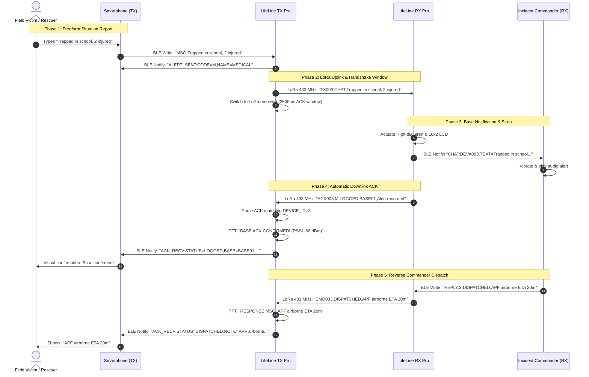

# LifeLine — Bluetooth Low Energy (BLE) Integration & Two-Way Mobile Companion Guide

> **Target Systems:** LifeLine TX Pro (Field Unit) & LifeLine RX Pro (Emergency Base Station)  
> **Wireless Protocol:** Bluetooth Low Energy (BLE 4.2 / 5.0) via NimBLE-Arduino  
> **GATT Profile:** Nordic UART Service (NUS)  
> **Companion Client:** Zero-Install Offline Web Bluetooth PWA (`docs/companion_app/index.html`)  

---

## 1. Overview & System Topology

LifeLine integrates **Bluetooth Low Energy (BLE)** on **both field transmitters and base stations**, allowing offline smartphones (Android and iOS) to act as tactical companions without cellular towers or internet access.

```text
 ┌───────────────────────────────────┐                 ┌───────────────────────────────────┐
 │     Field Victim / Rescuer        │                 │    Incident Commander / LDMC      │
 │          Smartphone               │                 │           Smartphone              │
 │  (Web Bluetooth PWA / BLE Serial) │                 │  (Web Bluetooth PWA / BLE Serial) │
 └─────────────────┬─────────────────┘                 └─────────────────┬─────────────────┘
                   │ BLE (Nordic UART)                                   │ BLE (Nordic UART)
                   │ Freeform Chat & Telemetry                           │ Incident Triage & Dispatch
                   ▼                                                     ▼
 ┌───────────────────────────────────┐    433 MHz LoRa ┌───────────────────────────────────┐
 │          LifeLine TX Pro          │◄───────────────►│          LifeLine RX Pro          │
 │       (Field Communicator)        │   TDD ACK/CMD   │       (Emergency Base Hub)        │
 └───────────────────────────────────┘                 └───────────────────────────────────┘
```

### Key Advantages of BLE over Classic Bluetooth (SPP)
1. **Full iOS & Android Compatibility**: Apple iOS strictly blocks Classic Bluetooth SPP (Serial Port Profile) without expensive proprietary Apple MFi chips. BLE GATT works natively on **both iPhone and Android**.
2. **Zero Extra Hardware Pins**: Uses the ESP32's built-in 2.4 GHz RF circuit. No GPIO pins are consumed.
3. **Ultra-Low Memory Footprint**: Powered by `h2zero/NimBLE-Arduino`, reducing Flash consumption by ~50% and RAM by ~100 KB compared to the standard Bluedroid stack.
4. **Coexistence with Wi-Fi**: On the RX Pro Base Station, NimBLE seamlessly time-multiplexes the 2.4 GHz radio between local broadband Wi-Fi and mobile BLE.

---

## 2. BLE GATT Profile Specification

Both devices implement the industry-standard **Nordic UART Service (NUS)**. This ensures immediate interoperability with third-party BLE terminal apps as well as the custom Web Bluetooth PWA.

### Service & Characteristic UUIDs

| Attribute | UUID | Type | Direction | Description |
| :--- | :--- | :--- | :--- | :--- |
| **Nordic UART Service** | `6E400001-B5A3-F393-E0A9-E50E24DCCA9E` | Primary Service | — | Root NUS GATT Service |
| **RX Characteristic** | `6E400002-B5A3-F393-E0A9-E50E24DCCA9E` | Characteristic | Mobile $\rightarrow$ Device (Write / Write Without Response) | Stream commands, text chat, and alerts into the ESP32 |
| **TX Characteristic** | `6E400003-B5A3-F393-E0A9-E50E24DCCA9E` | Characteristic | Device $\rightarrow$ Mobile (Notify) | Stream notifications, confirmations, alerts, and telemetry out to phone |

### Advertising Profiles

* **LifeLine TX Pro**:
  - Advertised Name: `LifeLine-TX-XXX` (e.g. `LifeLine-TX-003`, formatted by `DEVICE_ID`)
  - Auto-reconnect advertising restarts immediately on disconnection.
* **LifeLine RX Pro**:
  - Advertised Name: `LifeLine-RX-Base`
  - Continuous background advertising while simultaneously receiving LoRa packets and maintaining Wi-Fi.

---

## 3. Protocol & Command Set Reference

### 3.1 Field Transmitter (`LifeLine-TX-XXX`)

#### A. Mobile Phone $\rightarrow$ TX Pro Commands (Write to RX Characteristic)

| Command | Example | Description |
| :--- | :--- | :--- |
| `MSG:<TEXT>` | `MSG:3 trapped near bridge, need stretcher` | Encapsulates `<TEXT>` into LoRa frame `TX003,CHAT,...`, broadcasts over 433 MHz, and opens 2,500ms ACK listen window. |
| `ALERT:<CODE>` | `ALERT:A` or `ALERT:M` | Triggers a categorized SOS transmission (identical to keypad trigger) with automatic 2-way ACK wait. |
| `STATUS` | `STATUS` | Requests immediate hardware telemetry update from the field unit. |
| `PING` | `PING` | Health heartbeat check. |

#### B. TX Pro $\rightarrow$ Mobile Phone Notifications (TX Characteristic Notify)

| Notification Stream | Format | Meaning / Action |
| :--- | :--- | :--- |
| **Device Status** | `STATUS:DEV=003,BAT=92,LORA=OK,VER=v3.1.0 PRO` | Pushed on connection or query. Phone displays battery and link health. |
| **Alert Initiated** | `ALERT_SENT:CODE=A,NAME=EMERGENCY,TIME=142050` | Confirms transmission has left the SX1278 LoRa radio and ACK timer started. |
| **Base Confirmed (ACK)** | `ACK_RECV:STATUS=DISPATCHED,BASE=BASE01,NOTE=Rescue en route,RSSI=-68,SNR=9` | **Closed-loop confirmation**: The base station received the alert, and returned status and notes. |
| **ACK Timeout** | `ACK_TIMEOUT:NO_BASE_CONFIRMATION` | Base station radio shadow or out of range. Device triggers retry sequence. |

---

### 3.2 Base Station Receiver (`LifeLine-RX-Base`)

#### A. RX Pro $\rightarrow$ Mobile Phone Notifications (TX Characteristic Notify)

| Notification Stream | Format | Meaning / Mobile UI Trigger |
| :--- | :--- | :--- |
| **Distress Alert** | `ALERT:DEV=003,CODE=A,NAME=EMERGENCY,RSSI=-65` | Incoming SOS alert from field unit. Phone triggers loud acoustic chime and vibration. |
| **Field Chat Message** | `CHAT:DEV=003,TEXT=Landslide blocked road,RSSI=-62` | Freeform text situation report typed by field victim/rescuer. |
| **Sensor Telemetry** | `TELEMETRY:DEV=003,TEMP=21.4,HUM=88.2,LAT=27.717200,LON=85.324000,RSSI=-65` | Periodic sensor data (weather, landslide tilt, GPS coordinates) for map plotting. |
| **Base Status** | `STATUS:ROLE=BASE,LORA=OK,VER=v3.1.0 PRO` | System diagnostic heartbeat. |

#### B. Mobile Phone $\rightarrow$ RX Pro Commands (Write to RX Characteristic)

| Command | Example | Description |
| :--- | :--- | :--- |
| `MSG:<TEXT>` or `CHAT:<TEXT>` | `MSG:Camp site 2 flooded, move north` | Ingests direct tactical message, rendering on Full 16×2 LCD and broadcasting to paired commander phones. |
| `REPLY:<DEV_ID>,<STATUS>,<MSG>` | `REPLY:3,DISPATCHED,APF squad airborne ETA 20m` | Transmits downlink LoRa command frame `CMD003,DISPATCHED,...` directly to field unit #3. |
| `EVAC:ALL,<MSG>` | `EVAC:ALL,Dam breach head to high ridge` | Broadcasts emergency evacuation instruction frame `EVAC,ALL,...` to all listening field units. |
| `ACK:<DEV_ID>` | `ACK:3` | Manually triggers an acknowledgment downlink frame to unit #3. |

---

## 4. Mobile Client Connection Guide

### Option 1: LifeLine Companion Native Mobile App (React Native / Expo)

For field responders and incident commanders needing offline tactical dashboards on iOS and Android:
* **Directory**: [`lifeline_companion/`](file:///d:/lifeline_hardware/lifeline_companion/)
* **Tech Stack**: React Native, Expo, TypeScript, React Navigation.
* **Core Screens & Modules**:
  1. **Tactical Radar Screen (`RadarScreen.tsx`)**:
     - Visual circular sweeping radar animation with range rings (1 km, 3 km, 5 km).
     - Live signal strength indicator (RSSI in dBm) and estimated distance calculation.
     - Active field units card list with status badges (`NOMINAL`, `DISTRESS`, `OFFLINE`).
  2. **Field SITREP Composer (`SitrepScreen.tsx`)**:
     - 48-character LoRa message composer with tactical quick-chips ("Trapped at bridge", "Landslide blocked road").
     - Closed-loop ACK tracker displaying Base Station ID, RSSI, and dispatch note.
  3. **Settings & Diagnostics (`SettingsScreen.tsx`)**:
     - Device scanner and filter (`LifeLine-TX-*`, `LifeLine-RX-Base`).
     - Real-time packet throughput, dropped frames, and hardware uptime.
     - Built-in **Offline Mock Simulation Engine** for training without hardware.
* **Running Locally**:
  ```powershell
  cd lifeline_companion
  npm install
  npx expo start
  ```

### Option 2: Dedicated Offline Web Companion PWAs

LifeLine includes zero-install, offline **Progressive Web Apps (PWAs)** located in `bluefy_companion/`, `portal_preview/`, and `docs/companion_app/`:
* **Tactical Mission Hub & Auto-Detector**: [`docs/companion_app/index.html`](file:///d:/lifeline_hardware/docs/companion_app/index.html)
* **LifeLine TX Pro (Field Communicator)**: [`docs/companion_app/tx_companion.html`](file:///d:/lifeline_hardware/docs/companion_app/tx_companion.html)
* **LifeLine RX Pro (Base Incident Commander)**: [`docs/companion_app/rx_companion.html`](file:///d:/lifeline_hardware/docs/companion_app/rx_companion.html)
* **Universal Bluefy PWA**: [`bluefy_companion/index.html`](file:///d:/lifeline_hardware/bluefy_companion/index.html) (Optimized for iPhone Bluefy browser & Android Chrome).

#### How to Launch:
1. **No Internet Required**: Double-click `index.html` (or `bluefy_companion/index.html`) on your PC, or serve locally with `node serve_demo.js`.
2. **Supported Browsers**:
   - **Android / Windows / macOS / Linux**: Google Chrome, Microsoft Edge, Brave, Opera.
   - **iOS (iPhone / iPad)**: Bluefy Browser or WebBLE (free on App Store; Apple Safari does not expose Web Bluetooth).

#### Key Application Capabilities:
* **LifeLine TX Pro (`tx_companion.html`)**:
  - **15 Emergency Presets**: Full parity with on-device firmware (Codes A-O) with English and Nepali labels and safety slide-to-confirm modal.
  - **Freeform Chat Uplink**: 48-character LoRa text report composer with field chips ("3 trapped near school", "Road blocked by landslide").
  - **Closed-Loop Handshake HUD**: Live 2,500ms base station ACK listener countdown with Base Station ID, RSSI, SNR, and confirmation notes.
  - **Web Serial (USB 115200)** + **Demo Simulator**: Direct USB debugging and offline simulation mode.
* **LifeLine RX Pro (`rx_companion.html`)**:
  - **Live Incident Triage Feed**: Categorized disaster distress packets with severity badges (Critical, High, Medium, Nominal).
  - **Acoustic High-dB Siren**: Synthesized emergency siren and alert klaxon using Web Audio API with mute toggle.
  - **Active Field Units Radar**: Real-time signal strength meter, estimated distance calculation, and last seen timer.
  - **Reverse Commander Downlink**: 1-click tactical dispatch orders (`/airborne: APF Airborne ETA 20m`, `/hold: Hold Position`, `/medical: Medical Guidance`) and custom downlink frames.
  - **Mass Evacuation Broadcast**: Two-step safety locked `EVAC:ALL` broadcast over 433 MHz LoRa.
  - **Incident Audit Export**: Export timestamped incident records as CSV for government debrief.

---

### Option 2: Generic BLE Serial Terminal (Android)

If using a standard utility like **Serial Bluetooth Terminal** by Kai Morich:

1. Open **Serial Bluetooth Terminal** on your Android smartphone.
2. Open the menu $\rightarrow$ **Devices** $\rightarrow$ select the **Bluetooth LE** tab.
3. Tap **Scan** $\rightarrow$ select `LifeLine-TX-003` or `LifeLine-RX-Base`.
4. In Settings:
   - Service UUID: Standard Nordic UART (detected automatically).
   - Line Break: `LF (\n)` or `None`.
5. **Testing LifeLine-TX**:
   - Send: `STATUS` $\rightarrow$ Receive: `STATUS:DEV=003,BAT=...,LORA=OK`
   - Send: `MSG:Need assistance at bridge` $\rightarrow$ TX sends over LoRa $\rightarrow$ Receive: `ACK_RECV:...`
6. **Testing LifeLine-RX**:
   - Send: `REPLY:3,DISPATCHED,Team en route` $\rightarrow$ RX sends downlink LoRa packet.

---

### Option 3: nRF Connect for Mobile (Android & iOS)

1. Open **nRF Connect** and scan for devices.
2. Tap **Connect** next to `LifeLine-TX-003` or `LifeLine-RX-Base`.
3. Locate the service `6E400001-B5A3-F393-E0A9-E50E24DCCA9E` (Nordic UART Service).
4. Tap the **Triple Down Arrow** icon on characteristic `6E400003` to enable **Notifications**.
5. Tap the **Up Arrow** icon on characteristic `6E400002` to **Write** string commands (e.g. `ALERT:A` or `STATUS`).

---

---

## 5. On-Device Hardware Controls & Display Portals

In addition to phone companion apps, both LifeLine devices feature dedicated hardware UI workflows for field operators without needing any phone attached:

### 5.1 LifeLine TX Pro: Dedicated Bluetooth Portal & Tactical "MESSAGE SENDING" Pop Screen

On the LifeLine TX Pro 4×4 tactile matrix keypad and ST7789 2.8" SPI TFT display:
* **Opening Portal**: Press key **`'D'`** from the Main Menu. The ST7789 IPS display opens the high-tech tactical **BLE Manager Portal**.
* **Portal Features**:
  1. **Radio Power Toggle (`'1'`)**: Toggles the ESP32 2.4 GHz Bluetooth Low Energy radio instantly **ON or OFF**. When disabled, all RF advertising and background listening cease immediately, maximizing battery runtime in cold alpine environments.
  2. **Connected Client Status**: Displays real-time device connection state (`CONNECTED` / `STANDBY / ADV`), connected client name (e.g. `iPhone 15 Pro`), Bluetooth MAC address, and RSSI link strength.
  3. **Base Station Message Log (`'B'`)**: Displays recent downlink instructions, ACKs, and commands received from the Base Station. Press `'B'` to cycle through previous messages.
  4. **Exit Portal (`'#'` or `'D'`)**: Returns immediately to the Main Menu.

```text
┌────────────────────────────────────────┐
│  LIFELINE TX PRO - BLUETOOTH PORTAL   │
│  [1] BLE Power : [ ENABLED / ACTIVE ]  │
│  Client        : iPhone 15 Pro         │
│  Client MAC    : E2:1B:4F:92:80:C1     │
│  Link Signal   : -64 dBm (GOOD)        │
│────────────────────────────────────────│
│  LAST DOWNLINK FROM BASE:              │
│  [#1] "Rescue team en route via ridge" │
│────────────────────────────────────────│
│ [1]=Toggle Radio  [B]=History  [#]=Back│
└────────────────────────────────────────┘
```

#### Interactive "MESSAGE SENDING" Pop Screen on TX Pro
When a custom situation report or message is sent from the paired smartphone app (`MSG:<TEXT>` or `CHAT:<TEXT>`):
1. **Instant Modal Interrupt**: The firmware halts background rendering and pops up an interactive tactical modal:
   - **Header Beacon**: Pulsing cyan indicator with `[>] MESSAGE SENDING...`
   - **Mode Badge**: `BLE -> LoRa Uplink`
   - **Payload Card**: Displays the complete word-wrapped custom message body.
   - **Live Progress Gauge**: A sweeping segmented progress bar animates at ~20 FPS during the radio transmission and 5,000ms Base Station ACK listen window.
2. **Closed-Loop Outcome Banner**:
   - **ACK Confirmed**: `[ACK CONFIRMED!]` (Bright Emerald Green) displaying Gateway ID, RSSI, and notes.
   - **No ACK**: `[SENT (NO ACK)]` (Amber Advisory) if Base Station is out of direct Line-of-Sight.
3. **Smooth Dismissal**:
   - Auto-dismisses after 4 seconds, or instantly upon pressing **any keypad button**.
   - Preserves and restores the exact previous screen state (`SCREEN_BLE_PORTAL`, `SCREEN_MENU`, `SCREEN_SYSTEM_INFO`, etc.).

```text
┌────────────────────────────────────────┐
│  [>] MESSAGE SENDING...                │
│  [BLE -> LoRa Uplink]                  │
│┌──────────────────────────────────────┐│
││ SITREP: 3 TRAPPED NEAR BRIDGE NEED   ││
││ STRETCHER & MEDICAL KIT              ││
│└──────────────────────────────────────┘│
│  TX Status: LoRa Airtime & ACK Wait    │
│  [████████████████░░░░░░░░░░░░░░░░]    │
│  Base ACK: [ACK CONFIRMED! -68dBm]    │
│  [Press any key or wait 4s to close]   │
└────────────────────────────────────────┘
```

---

### 5.2 LifeLine RX Pro: Full 16×2 LCD Custom Message Display (Wi-Fi Button & Auto-Page)

On the LifeLine RX Pro Base Station:
* When custom mobile chat reports (`MSG:<TEXT>`), commander instructions, or emergency LoRa chat packets arrive:
  - **Full 16×2 Character Utilization**: The screen switches into dedicated message mode, dedicating **both Row 0 AND Row 1 (all 32 characters)** entirely to the message payload rather than sacrificing half the screen to headers.
  - **Smart Word-Wrapping (`formatLCDTwoRows`)**: Intelligently breaks lines on spaces within the last 5 characters to avoid slicing words across lines.
  - **Dual Ingestion**: Direct BLE Bluetooth messages (`MSG:<text>` / `CHAT:<text>`) from incident commander smartphones and remote LoRa frames (`CHAT:<msgId>:<devId>:<text>`) are rendered identically.
* **Hands-Free Auto-Paging & Manual Scrolling**:
  - **Hands-Free Auto-Page**: If a message exceeds 28 characters, the screen smoothly cycles to the next page every 4 seconds (`scrollCurrentMessage(false)`) without resetting the 15-second return timer.
  - **Manual Page Advance**: A short tap on the physical Wi-Fi button (GPIO 14) invokes `scrollCurrentMessage(true)`, sounding an affirmative chirp (`playSkipConfirmTone()`) and advancing the page while refreshing the 15-second reading timer.
* **Zero Feature Conflict**:
  - Triple-clicking GPIO 14 within 1.5 seconds triggers **Local Web OTA Mode**.
  - Holding GPIO 14 for 3 seconds opens the **Wi-Fi Captive Configuration Portal**.
  - Short tap during message display specifically advances message pages.

#### Station Web Dashboard (`http://<RX_IP>`):
When LifeLine RX Pro connects to your local Wi-Fi router, it displays its assigned IP on the 16×2 LCD (`IP: 192.168.x.x`). Navigating to `http://<RX_IP>` in any web browser opens the **Base Station Command Dashboard**:
1. **Live System Diagnostics**: Real-time IP, Wi-Fi link RSSI, free heap memory, and NTP time sync.
2. **Cloud REST API Key & Endpoint Manager**:
   - Update the **API Authentication Key** (`X-API-Key` and `Bearer`) and **API Endpoint URL** without reflashing the device.
   - Settings are stored persistently in ESP32 Non-Volatile Storage (NVS).
3. **Direct Web OTA Firmware Flashing**:
   - Select any compiled `firmware.bin` file and click **FLASH FIRMWARE (OTA)**.
   - The 16×2 LCD displays real-time flashing progress (`Updating FW XX%`), sounds a completion chime, and reboots the base station automatically.
4. **Multi-WiFi Credential Management**: Update or add up to 3 fallback Wi-Fi networks.

---

## 6. End-to-End Two-Way Communication Flow



---

## 7. Flash Partition & Memory Footprint

To allow both **NimBLE-Arduino** and **Wi-Fi / OTA** to operate safely on the ESP32 without memory overflow:

```ini
; platformio.ini
board_build.partitions = min_spiffs.csv

lib_deps =
    sandeepmistry/LoRa @ ^0.8.0
    h2zero/NimBLE-Arduino @ ^1.4.2
```

### Partition Budget Breakdown (`min_spiffs.csv`)

| Partition | Allocated Size | Current TX Pro Flash | Current RX Pro Flash |
| :--- | :--- | :--- | :--- |
| **`app0` (Application A)** | **1,966,080 bytes (1.96 MB)** | **1,359,488 bytes (69.1%)** | **1,498,892 bytes (76.2%)** |
| **`app1` (OTA Fallback B)** | **1,966,080 bytes (1.96 MB)** | Available for OTA | Available for OTA |
| **`spiffs` (File System)** | **196,608 bytes (192 KB)** | Reserved for offline assets | Reserved for offline assets |
| **RAM (Dynamic Heap)** | **327,680 bytes (320 KB)** | **61,840 bytes (18.9%)** | **64,068 bytes (19.6%)** |

> [!NOTE]
> Both units have over **460 KB to 600 KB of Flash headroom** and over **260 KB of free RAM**, ensuring rock-solid stability in high-stress disaster scenarios.

---

## 8. Field Troubleshooting & Diagnostics

1. **Smartphone cannot find device in Bluetooth scan**:
   - Ensure phone Bluetooth and **Location Services** (GPS) are turned ON (required by Android OS for BLE scanning).
   - Ensure the ESP32 is powered. Check the TX Pro ST7789 TFT screen: the top right header should display `BLE ADV` or `BLE ON`.
2. **Web Bluetooth not working**:
   - Ensure you are using **Google Chrome** (Android/Desktop) or **Bluefy** (iOS). Safari and generic webviews do not support Web Bluetooth.
   - Web Bluetooth requires `https://` or `localhost` / file origin.
3. **No ACK received on field unit**:
   - Check if Base Station RX is powered and within radio range.
   - If deep in a river canyon or behind a ridge, move up 10–20 meters toward the canyon rim to regain Line-of-Sight (LOS).
   - The field unit will automatically back off and retry up to 3 times with randomized anti-collision intervals.
